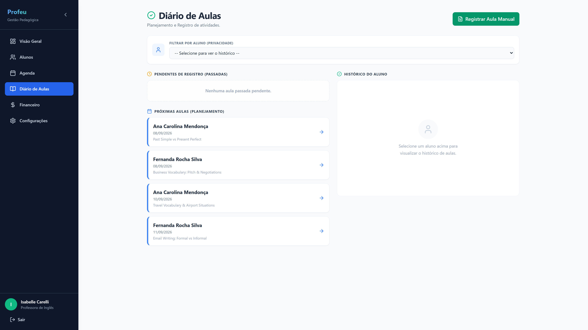
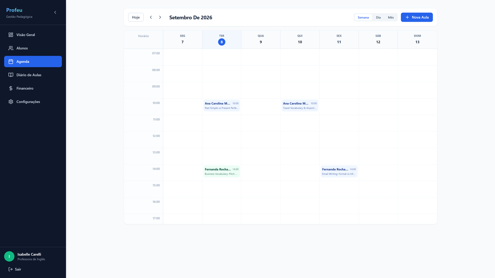
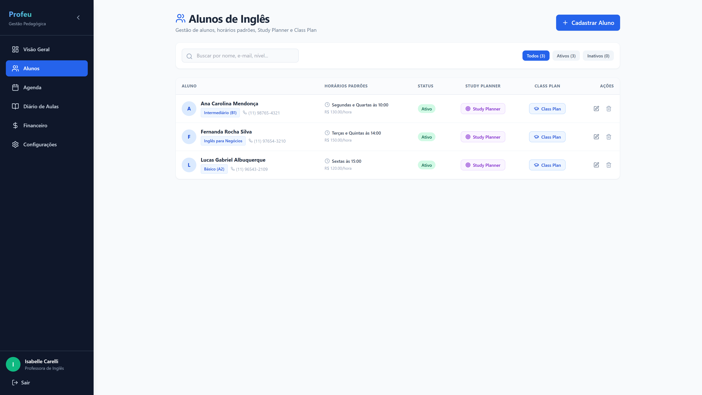
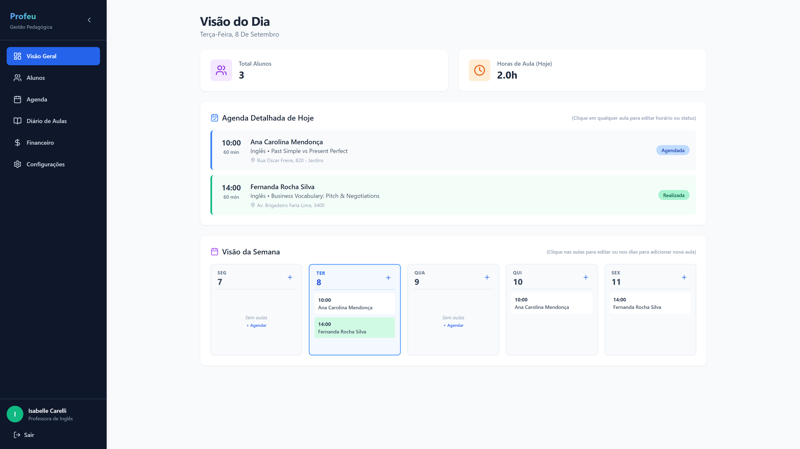

# 🎓 Ms Carelli - Plataforma Pedagógica para Professora de Inglês

Sistema moderno de gestão pedagógica, planejamento de aulas e controle financeiro especializado para **Professora Particular de Inglês**, construído com **React**, **TypeScript**, **Vite** e **Tailwind CSS**, com persistência local de dados e deploy automatizado no **Appwrite Sites**.

---

## 📸 Demonstração Visual das Telas

| Diário de Aulas (Planejamento & Histórico) | Agenda Estilo Google Agenda |
| :---: | :---: |
|  |  |

| Gestão de Alunos (Study Planner & Class Plan) | Visão Geral (Dashboard do Dia) |
| :---: | :---: |
|  |  |

---

## 🚀 Funcionalidades Especializadas em Inglês

1. **Diário de Aulas (Fidelidade 1:1 à Referência):**
   - Filtro de privacidade por aluno.
   - Acompanhamento de aulas passadas pendentes de registro pedagógico.
   - Próximas aulas agendadas com acesso rápido.
   - Histórico cronológico completo por aluno com lição de casa (*homework*), tópicos gramaticais e vocabulário.
   - Botão para **Registro Manual de Aula**.

2. **Agenda Estilo Google Agenda:**
   - Visualização por **Semana**, **Dia** ou **Mês**.
   - Grade horária das 07:00 às 21:00 com blocos visuais proporcionais à duração.
   - Cores intuitivas por status (Realizada em verde, Agendada em azul, Cancelada em vermelho).
   - Clique em qualquer espaço vazio para agendar aula naquele horário.
   - Clique em qualquer aula existente para editar horários, status ou remover.

3. **Gestão de Alunos & Planos de Aprendizado:**
   - Cadastro completo de alunos com nível de inglês (A1 até C2 / Business / IELTS).
   - Coluna de **Horários Padrões de Aula** e valor individual por hora.
   - Botão **Study Planner**: Cronograma de estudos independente do aluno (horas semanais, metas, podcasts, aplicativos recomendados e rotina).
   - Botão **Class Plan**: Plano de aula pedagógico estruturado (unidade atual, foco gramatical, vocabulário, lição de casa e objetivos).
   - Edição e exclusão com persistência de dados em tempo real.

4. **Visão Geral (Dashboard):**
   - Todos os horários da "Agenda Detalhada de Hoje" e da "Visão da Semana" são 100% clicáveis e editáveis.
   - Métricas em tempo real recalculadas conforme o banco de dados.

5. **Controle Financeiro 100% Editável:**
   - Demonstrativo de faturamento mensal por aluno.
   - Valores por hora e quantidade de aulas editáveis diretamente na tabela.
   - Alternância com 1 clique entre **"Pago"** e **"Pendente"**.
   - Totais consolidados de receita recebida, previsão mensal e valores a receber.

6. **Banco de Dados & Persistência Local:**
   - Serviço desacoplado `db.ts` utilizando armazenamento local resiliente e tipado.
   - Zero dados fictícios forçados: o sistema armazena os dados reais cadastrados pela professora.

---

## 🛠️ Tecnologias Utilizadas

- **Frontend:** React 18, TypeScript, Vite 6
- **Estilização:** Tailwind CSS 3 (tema slate com cores pedagógicas)
- **Ícones:** Lucide React
- **Persistência:** Local Database Service (`localStorage` estruturado com schemas tipados)
- **Deploy:** Appwrite Sites (com roteamento SPA e fallback `index.html`)

---

## 💻 Execução Local

```bash
# Instalar dependências
npm install

# Iniciar servidor de desenvolvimento
npm run dev

# Gerar build de produção
npm run build

# Pré-visualizar build de produção
npm run preview
```

---

## 🌐 Deploy no Appwrite Sites (Passo a Passo)

1. No Console do Appwrite (**Sites** > **Create Site**):
2. Conecte com seu repositório: `isabellecarelli/mscarelli` na branch `main`.
3. Preencha as configurações de build:
   - **Framework:** `Vite`
   - **Root Directory:** `./`
   - **Install Command:** `npm install`
   - **Build Command:** `npm run build`
   - **Output Directory:** `dist`
   - **Fallback:** `index.html`
4. Clique em **Deploy**. O deploy será concluído e uma URL com certificado SSL será gerada.
